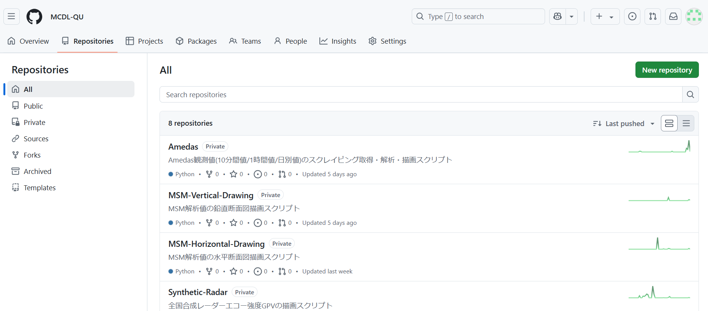
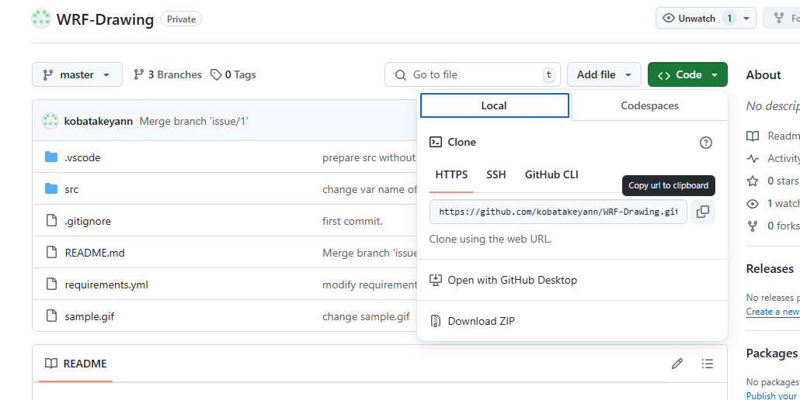
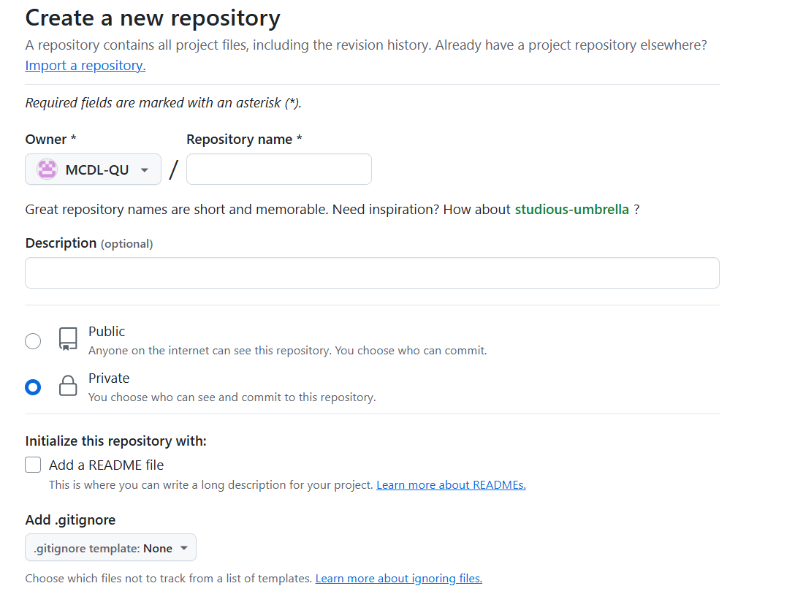
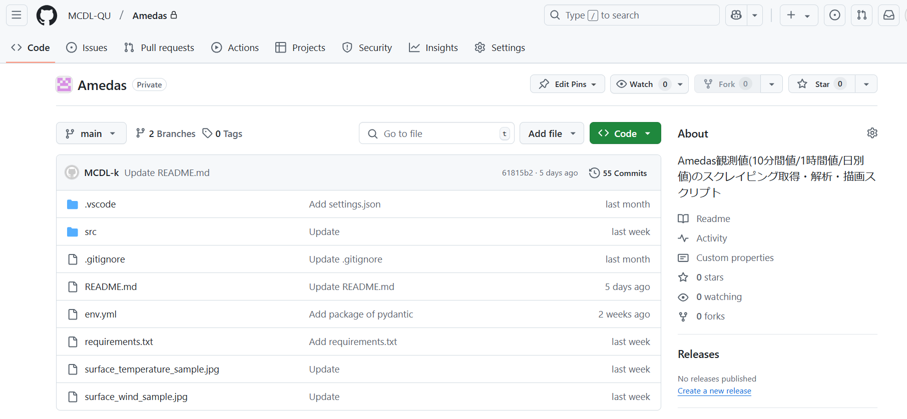

## MCDL Github Organization

ソースコードを共有するための私達の github organization です。私達の組織アカウントの使い方について説明します。

マシン上では読み取り権限の問題であったり、ソースコードの場所が不明であったり、マシン間での移動が必要だったりすることで、ソースコードの共有が煩わしいので、github organization で README.md 付きで共有します。これにより、どのマシンかに関係なく自由にアップロード、ダウンロードができます。また、ソースコードに更新があったときも容易に更新を反映できるという点でも有用性が高いです。

また、研究のためのスクリプトが蓄積されていき、組織としての共有が進んでいくことで、研究の効率化が期待できます。

github 上のコードは非公開(private)とするので、外部からは見えません。また、各個人が github の アカウントを有しさえおけば、vscode と github 間の認証機能を利用することで、特別な ssh 接続の設定なしに利用できるようです。

---

## ソースコードの利用手順

1. github Organization のページに行く
2. 利用したいソースコードのリポジトリを選択する

   

3. `code` の `HTTPS` を選択し、URL をコピーする

   

4. ローカルで、ソースコードをもってきたいディレクトリに移動し、clone する。

   ```bash
   cd path/to/your/directory
   git clone copied_url directory_name
   ```

※clone が上手くいかないときは HTTPS の URL から clone するのではなく、 `Download ZIP` でも OK

※2025/2/28 現在、`storm` では OS のバージョンが古いようで `clone` できないようです。

---

## ソースコードのアップロード手順(リモートリポジトリの作成)

1. 右上の `New repository` から、リポジトリを新規作成する

   

2. `Repository name`に英語で適当な名前をつけ、 `Description`に日本語で説明を入力し、`private` にチェックを入れて作成する。

   

3. ローカルから作成したリモートリポジトリに push する

   ```bash
   # gitの管理下とする
   git init
   git add .
   git commit -m "first commit"
   git branch -M main

   # リモートリポジトリを紐づける
   git remote add origin リモートリポジトリのURL

   # リモートリポジトリにpushする
   git push -u origin main
   ```

4. github のリポジトリのページをリロードして、以下のようにソースコードがあることが確認できれば OK

   

※git init 前の git アカウントの設定

```bash
git config --global [user.name](http://user.name/) "your email address"
git config --global user.email "your email address"
```

---

## Note

- リポジトリを作成する際は、`private`リポジトリとすること
- `README.md` ファイルをつけること
- `git push` すると自身が編集した内容が反映されてしまうので気をつけること
  (変更をアップロードする必要がなければ、`rm -rf .git` で git の管理下から外れても OK)

---

### 管理者へ

- マシン係は管理者を引き継いで、メンバーの Organization への参加と team への追加対応をする
- メンバーに適切に権限を設定し、リポジトリが破壊されないようにすること
- [詳細はこちら](https://www.notion.so/Github-Organization-c9b1e493d2354ca9a6da1fc9d1c8e231)
